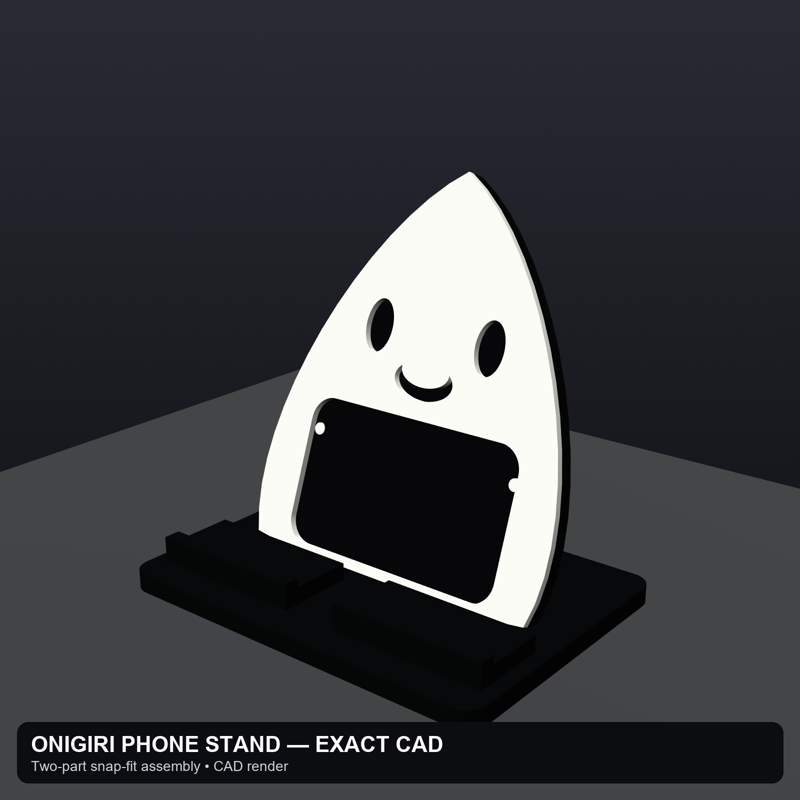

# Onigiri Phone Stand

A two-color, 3D-printable phone stand designed for the Bambu Lab P1S. The black structural core supports the phone at 70 degrees, while a separate white decorative shell snaps onto four pegs.



## Project layout

- `src/` — parametric CadQuery model and exact-CAD rendering scripts
- `models/` — final STL and STEP exports
- `renders/` — four consistent listing images generated from the final CAD
- `docs/` — specifications, validation, and prototype checklist
- `archive/failed-v1/` — the rejected first prototype, retained for reference only

## Final design

- Overall size: approximately 132 × 96 × 126 mm
- Phone angle: 70 degrees above the desk
- Shelf depth: 23 mm
- Charging opening: 18 mm
- Two-color construction: black core and white snap-on shell
- Four 4.0 mm pegs with 4.45 mm sockets
- Nominal radial press-fit clearance: 0.225 mm

## Build the model

Install Python 3.12 or newer, then:

```powershell
python -m pip install -r requirements.txt
python src/build_model.py
python src/render_listing_images.py
```

The scripts regenerate the files in `models/` and `renders/`.

## Printing

Import `models/black_core.stl` and `models/white_shell.stl` together as a single object with multiple parts so their shared coordinates stay aligned. Assign black filament to the core and white filament to the shell.

The assembled model was verified on a Bambu Lab P1S build plate with no mesh, non-manifold, or boundary warnings. Nothing has been physically test-printed yet; complete the checklist in `docs/prototype-checklist.md` before selling it.

## Status

CAD complete, meshes validated, renders complete, slicer-fit verified. Physical fit and stability testing remain.
